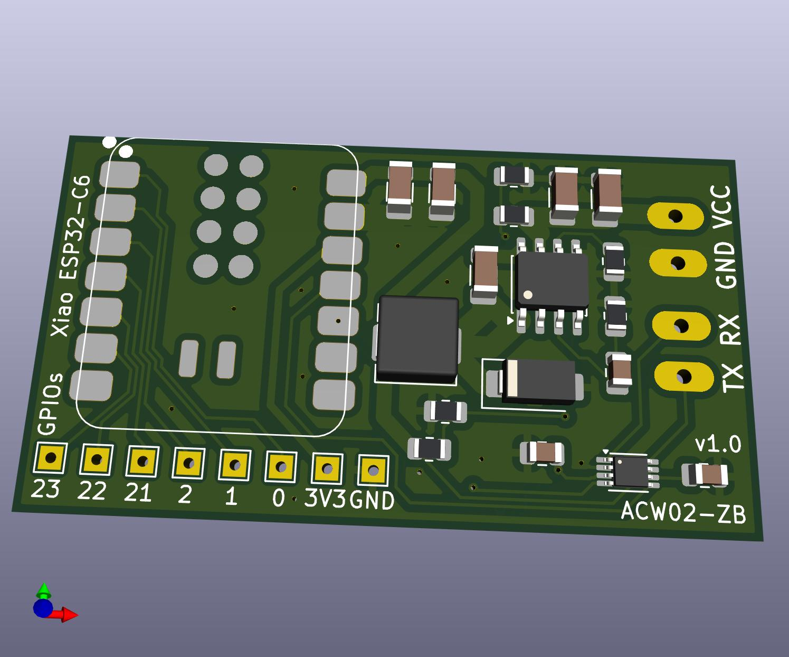

| Supported Targets | ESP32-C6 | ESP32-H2 |
| ----------------- |  -------- | -------- |

# ACW02-ZB Zigbee HVAC Thermostat Controller

# Project Description
ACW02-ZB is an open-source Zigbee-enabled HVAC controller for the Airton (to replace ACW02 WiFi module) series and compatible units. It allows full integration with Zigbee2MQTT, Home Assistant, and other Zigbee ecosystems, providing remote control, monitoring, and diagnostics for air conditioning systems.

### Key Features
- **Zigbee 3.0 End Device**: Compatible with ESP32-C6 and ESP32-H2
- **Full HVAC Control**: Supports on/off, mode, setpoints, fan speed, swing, eco, night, mute, and display
- **Error Diagnostics**: Exposes AC error codes and status via Zigbee attributes (Only one cade currently)
- **Automatic Polling**: Uses Z2M's generic polling framework for unreportable attributes
- **Auto-Rejoin**: Device automatically rejoins Zigbee network after removal or network loss
- **Clean Entity Names**: Optimized for Home Assistant and Zigbee2mqtt UI
- **Factory Reset**: Long-press boot button 5s for full reset
- **Open Hardware**: PCB and schematic files included (Using Seeedstudio Xiao ESP32-C6)

### Architecture
- **Firmware**: ESP-IDF C code for Zigbee stack, HVAC protocol, and attribute mapping
- **External Converter**: Custom Zigbee2MQTT JS converter for multi-endpoint mapping and polling

### Typical Use Cases
- Integrate Airton (to replace ACW02 WiFi module) with Home Assistant via Zigbee2MQTT
- Monitor and control HVAC remotely (mode, temperature, fan, swing, eco, etc.)
- Receive error codes and filter status for maintenance
- Automatic recovery from network disruptions

### Getting Started
1. Flash ESP32-C6/H2 with provided firmware
2. Add external converter to Zigbee2MQTT
3. Pair device and configure entities in Home Assistant
4. Use Z2M UI or automations for full control and monitoring

See the documentation files for advanced features, troubleshooting, and hardware details.

---

## PCB

The PCB has been tested for a couple of weeks now on 4 units and is working well.
I am using a Seeedstudio Xiao ESP32-C6 with a custom buck converter (based on a MPS MP1584) and a level shifter for TX/RX (using a Texas Instrument TXB0102)

PCB is small, 48mm x 27mm so there is no problem to fit it inside the unit.
---

## 🙌 Credits

- Original HVAC reverse‑engineering and ESPHome work: [devildant/acw02_esphome](https://github.com/devildant/acw02_esphome)  
- Zigbee2MQTT ecosystem: [Koenkk/zigbee2mqtt](https://github.com/Koenkk/zigbee2mqtt) and [zigbee-herdsman-converters](https://github.com/Koenkk/zigbee-herdsman-converters)

## 🛡️ License

This repository uses multiple licenses depending on content type:

- **Code** (`*.yaml`, `*.cpp`, `*.h`) — [GNU GPLv3](./LICENSE)  
- **PCB files** (`*.zip`, `*.json`) — [CC BY-NC-SA 4.0](./LICENSE-hardware)

---

# ⚠️ Disclaimer

This project is provided as-is, without any warranty or guarantee of fitness for a particular purpose. Use at your own risk. The authors and contributors are not responsible for any damage, malfunction, or loss resulting from the use, modification, or installation of this hardware or software.

- This is an open-source, community-driven project intended for educational and experimental use.
- The hardware and firmware are not certified for commercial or safety-critical applications.
- Always follow proper electrical safety procedures when working with HVAC systems and mains power.
- Modifying or installing this project may void your equipment warranty.
- Ensure compliance with local laws and regulations regarding wireless devices and HVAC modifications.

By using this project, you acknowledge and accept these terms.

